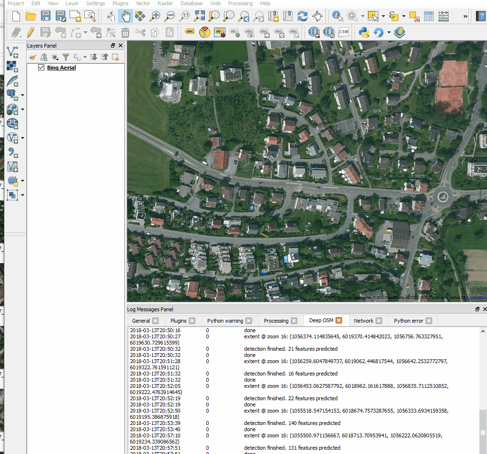

# Change Detector from Image to Vector
Instance segmentation with neural networks based on aerial images
This project is about generating building footprints from orthophotos (i.e. aerial imagery) using deep learning.


## Quick Start
This repository can be used for various tasks, like training the neural network, debugging it using the jupyter notebooks, generate training data or run the prediction as backend for the QGIS plugin.
In order to do so, complete the following tasks

### 1. Build the docker image
Make sure the current directory of the console you're using is the 'osm-instance-segmentation' folder.
```
nvidia-docker build -t deeposm .
```

This builds the image and installs all required dependencies.

### 2. Run the container
Have a look at the volumes that are being mounted, of course, you've to update the paths to match your current filesystem but dont change the names of the target volumes, that will be mounted inside the docker container.

If you don't intend to train the neural network, you can skip the second volume, which is only necessary, if any training data is needed.

The last volume `~/dev/model:/model` has to contain a valid model, if the prediction should be run. A model contains the learned configuration of the neural network and always has the file extension `.h5`. If you put multiple models in the model folder, the first found will be used.

```
nvidia-docker run -d --name deeposm -v ~/dev/osm-instance-segmentation/:/osm-instance-segmentation -v ~/dev/training-data:/training-data -v ~/dev/model:/model -p 8000:8000 deeposm
```

### 3. Do something with the container

Now the container is running and you can open a console to execute commands in the container:
```
docker exec -it deeposm bash
```

Or you can run a command directly, like starting the backend:
```
docker exec -it deeposm python manage.py runserver 0.0.0.0:8000
```

The django webserver is now available on port 8000 of the docker container.


## Training Data
To generate the training data, you first need a Microsoft Bing developer key, which you can obtain here: https://www.bingmapsportal.com/.
The key needs to be assigned like this, in a file `secrets.py` in the root folder of this project.

```
# Content of secrets.py

BING_KEY = "insert your key here"
```

Then run the following command:

```
python -m core.generate_training_data
```

As soon as this is completed, run the following command to clean up the generated data:

```
python -m core.cleanup
```


## QGIS Plugin
The QGIS plugin can be found in the folder `/qgis_plugin`. It can be installed by opening a cmd in the plugin folder and running the following command, which creates a symlink:

 ```
mklink /D "%userprofile%/.qgis2/python/plugins/deep_osm" %cd%
 ```



## Web service
The server can be started using the script ```runserver.bat```.

To run the server in the docker container, execute the following command:

```
python web/manage.py runserver
```